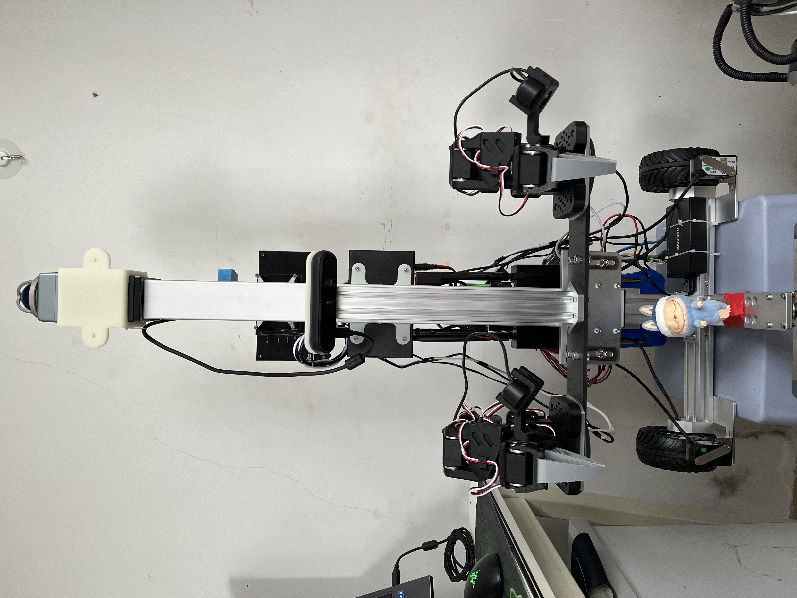
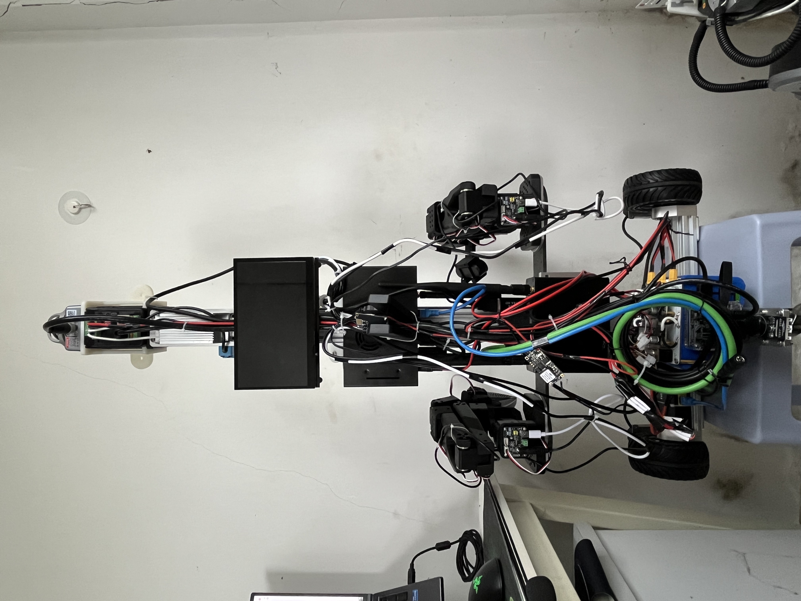

# 家庭服务机器人
## 1.项目介绍
主控基于两台Jetson orin nano super8G，一台运行导航、控制与语音交互等，另外一台调用GPU运行VLA，通过Ros作为通讯桥梁;Cpp开发,humble版本;导航基于Mid360s;双臂基于huggingface的lerobot;PCB与CNC来源立创免费打样。
## 2.使用说明🌟🌟🌟
可结合本人blibli此系列视频进行操作(未更新)，视频链接：[jetson nano部署fastlio2建图加定位，A*规划导航](https://www.bilibili.com/video/BV1tbQGBkE4F?vd_source=956043e91d9fa045c1e7c746411b5102)  
借鉴项目(现在已完成全部环境部署运行，导航完成，遥操训练正在制作，零件等全由本人DIY )：  
- 建图算法：fast_lio2_ros2：[https://github.com/Ericsii/FAST_LIO_ROS2?tab=readme-ov-file](https://github.com/Ericsii/FAST_LIO_ROS2?tab=readme-ov-file)
- 定位算法：FAST_LIO_LOCALIZATION_HUMANOID：[https://github.com/deepglint/FAST_LIO_LOCALIZATION_HUMANOID/tree/humble#](https://github.com/deepglint/FAST_LIO_LOCALIZATION_HUMANOID/tree/humble#)
- 3D-2D图压缩用于Nav2:[https://github.com/LihanChen2004/pcd2pgm](https://github.com/LihanChen2004/pcd2pgm)
- 机械臂：双臂lerobot：[https://github.com/huggingface/lerobot](https://github.com/huggingface/lerobot)  
### 2.1 若您想部署该项目的导航部分，请先确保源项目网址分步部署成功⚠️⚠️⚠️
- **livox_ws为mid360s的ros2驱动文件;**  
- **mid360s_ws为fastlio2的建图文件；**  
- **fastlio_localization为open3d定位文件；**  
- **luckrobot_ws为底盘驱动、部分tf链条与Nav2导航文件等**   

### 2.2 该代码仓库相对于源克隆网址做了代码修改，以下是本人部署步骤，可作为您的参考：
- 首先确定您的mid360s的sdk安装没问题，在ros2的rviz2下能正常可视化到3d点云，注意MID360s_config.json配置的旋转平移矩阵。对应该项目的livox_ws文件夹
- 确定您的mid360s部署fast_lio2建图没问题，注意config下的mid360.yaml的配置，理解每一项；该launch启动文件包的名称我做了修改：ros2 launch fast_lio_map mapping.launch.py，否则会和fastlio_localization下的fastlio有一定的命名冲突。对应该项目的mid360s_ws文件夹
- 紧接着部署FAST_LIO_LOCALIZATION_HUMANOID，open3d启动会消耗较大的cpu资源，除部署阶段不建议开启rviz。对应该项目的fastlio_localization文件夹：其子文件夹FAST_LIO与建图文件基本保持一致，注意对比config下的配置文件区别；open3d_loc下的global_localization.cpp文件我也做了优化修改，您可自行对比，重点注意launch下的两个文件的配置内容，我做了部分修改，其中open3d_loc_go1.launch文件我重点修改了open3d的点云采样配置，降低采样配置更好地适配jetson的性能
- 在部署上述项目阶段，注意tf链条完整与各项数据输出正确。然后我们将3d点云图体素滤波等，可参考luckrobot_ws/src/map_clear文件。后部署3D-2D图压缩项目，对应文件luckrobot_ws/src/pcd2pgm，注意理解config下的配置文件各项（我的仓库该config中有解释），注意您的压缩高度范围，需要和后续的导航点云高度提取范围保持一致
- 在导航之前运行sudo apt install ros-${ROS_DISTRO}-pointcloud-to-laserscan，这个功能包可以将你的所选高度范围的3d点云投影压缩为2d，另外还需要做一些重映射，防止话题冲突，这部分代码都在open3d的open3d_loc_g1.launch.py下有介绍
- luckrobot_ws下为本人开发的cpp包。keyboard_control为键盘控制，发布cmdvel控制小车移动建图；robot_display主要为机器人的静态tf发布；wheel_controller为控制小车底盘、丝杠、语音指令与动态tf发布节点；nav2三个文件夹分别为控制器、规划器和nav2的配置三个文件夹，可结合鱼香ros的自定义规划控制算法进行理解这几个包；luckrobot_launch1为一键启动该机器人导航定位等功能的包
### 2.3 Node Graph与TF tree
**以下为运行：ros2 launch luckrobot_launch1 luckrobot_bringup.launch.py 生成的节点关系图与tf链条图**

**tftree中：body和imu_link重合，都为雷达imu坐标系**

## 3.算法核心🤔🤔🤔
### 3.1 建图算法：FAST-LIO 2.0 (2021-07-05 Update)

**相关视频:**  [FAST-LIO2](https://youtu.be/2OvjGnxszf8),  [FAST-LIO1](https://youtu.be/iYCY6T79oNU)

**流程:**

**新功能:**
1. 利用[ikd-Tree](https://github.com/hku-mars/ikd-Tree)进行增量映射，实现更快的速度和超过 100Hz 的激光雷达速率。
2. 对原始激光雷达点进行直接里程测量（扫描到地图）（可禁用特征提取），实现更高精度。
3. 由于无需特征提取，FAST-LIO2 支持多种类型的激光雷达，包括旋转激光雷达（Velodyne、Ouster）和固态激光雷达（Livox Avia、Horizon、MID-70），并且可以轻松扩展以支持更多激光雷达。
4. 支持外部IMU。
5. 支持基于ARM的平台，如Khadas VIM3、Nivida TX2、Raspberry Pi 4B（8G RAM）。
### 3.2 定位算法：FAST_LIO_LOCALIZATION_HUMANOID
**流程:**

**基于离线点云地图的稳健本地化**  
此解决方案能够处理**粗略的初始姿态** ，支持**稳健的定位** ，并且离线点云地图保证不会因长时间工作而**累积的定位误差**（不同于常见的 SLAM）。彩色点云的可视化效果更好。

### 3.3图压缩&Nav2
**基于 ROS2 和 PCL 库，用于将 `.pcd` 点云文件转换为用于 Navigation 的 `pgm` 栅格地图**

|pcd|pgm|
|:-:|:-:|
|||
## 4.安装依赖与编译项目

## 5.实物图片📸 📸 
- 实物(仍在完善优化)  

  
  

## 6.📩作者
- [Luckme921](https://github.com/Luckme921)
- **邮箱**：1814313359@qq.com